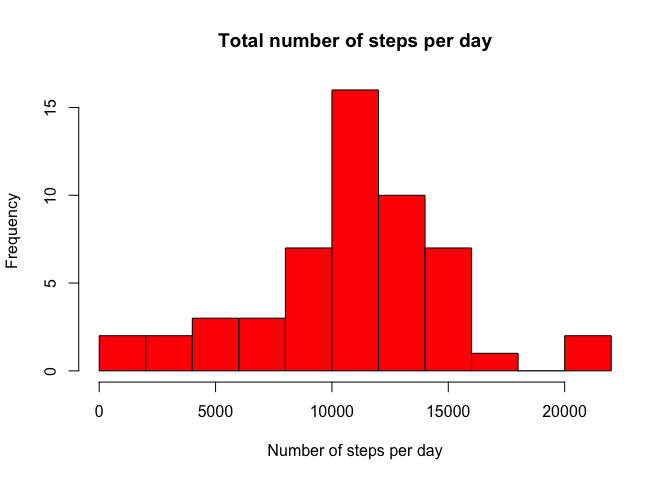
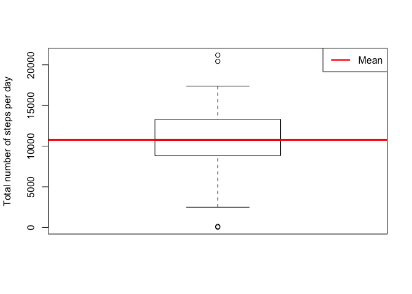
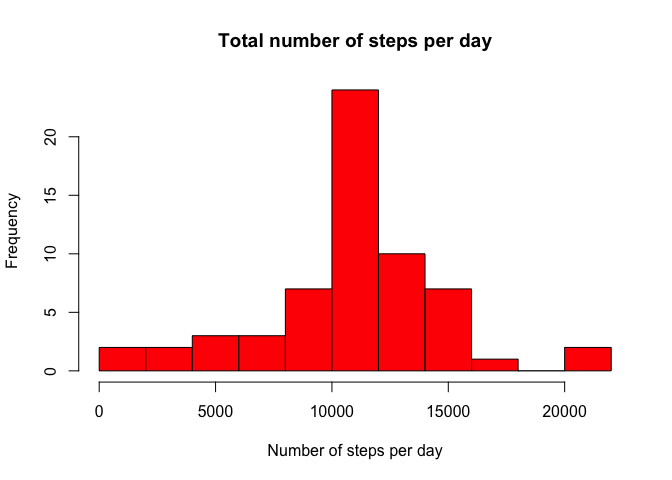
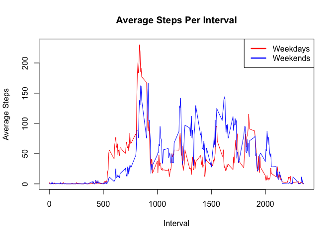

# Reproducible Research: Peer Assessment 1


```r
library(dplyr)
library(lubridate)
activity.data <-
  read.csv(unzip("activity.zip", 'activity.csv')) %>%
  mutate(
    date = ymd(date), 
    weekday = !(wday(date) %in% c(7, 1)),
    interval = as.numeric(interval))
activity.data.wo.na <- filter(activity.data, !is.na(steps))

total.number.of.steps.per.day.wo.na <- aggregate(activity.data.wo.na$steps,
                                                 by=list(activity.data.wo.na$date),
                                                 FUN=sum)
hist(total.number.of.steps.per.day.wo.na$x,
     col = 'red',
     breaks = 10,
     xlab = "Number of steps per day",
     main = "Total number of steps per day")
```

 

```r
mean.steps.per.day <- mean(total.number.of.steps.per.day.wo.na$x, na.rm = T)
boxplot(total.number.of.steps.per.day.wo.na$x, ylab = 'Total number of steps per day')
abline(h = mean.steps.per.day , lwd = 3, col = 'red')

legend(
  'topright',
  c('Mean'),
  lty = 1,
  lwd = 2.5,
  col = c('red'))
```

 

```r
mean.steps.per.interval <- aggregate(activity.data.wo.na$steps,
                                     by=list(activity.data.wo.na$interval),
                                     FUN=mean)
plot(mean.steps.per.interval$Group.1,
     mean.steps.per.interval$x,
     type='l',
     ylab='Average Steps',
     xlab='Interval')
```

 

```r
internval.with.highest.mean.steps <-
  mean.steps.per.interval[which.max(mean.steps.per.interval$x), ]$Group.1
```

Interval 835 has the highest average steps


```r
number.of.rows.with.na <- nrow(activity.data) - nrow(activity.data.wo.na)
```

There are 2304 observations missing step data.


```r
library(dplyr)
na.rows.with.steps <-
  activity.data %>%
  filter(is.na(steps)) %>%
  inner_join(mean.steps.per.interval, by = c("interval" = "Group.1")) %>%
  mutate(steps = x) %>%
  select(-c(x))

composite.activity.data <- bind_rows(activity.data.wo.na, na.rows.with.steps)

total.number.of.steps.per.day <- aggregate(composite.activity.data$steps,
                                           by=list(composite.activity.data$date),
                                           FUN=sum)
hist(total.number.of.steps.per.day$x,
     col = 'red',
     breaks = 10,
     xlab = "Number of steps per day",
     main = "Total number of steps per day")
```

 

```r
composite.mean.steps.per.day <- mean(total.number.of.steps.per.day$x, na.rm = T)
composite.median.steps.per.day <- median(total.number.of.steps.per.day$x, na.rm = T)
```

If interval means are subsituted for NA values then  
* The mean steps per day is 10766.19
* The median steps per day is 10766.19


```r
composite.mean.steps.per.interval <- aggregate(composite.activity.data$steps,
                                               by=list(composite.activity.data$interval,
                                                       composite.activity.data$weekday),
                                               FUN=mean)
plot(composite.mean.steps.per.interval$Group.1,
     composite.mean.steps.per.interval$x,
     type="n",
     ylab = "Average Steps",
     xlab = "Interval",
     main = "Average Steps Per Interval")

weekdays <-
  composite.mean.steps.per.interval %>%
  filter(Group.2)

weekends <-
  composite.mean.steps.per.interval %>%
  filter(!Group.2)

lines(weekdays$Group.1, weekdays$x, col="red")
lines(weekends$Group.1, weekends$x, col="blue")

legend(
  'topright',
  c('Weekdays', 'Weekends'),
  lty = 1,
  lwd = 2.5,
  col = c('red', 'blue'))
```

 


